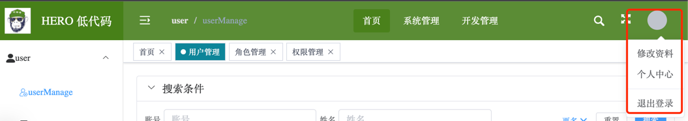

# user-dropdown 头像下拉

点击用户头像显示的下拉选，通常位于界面布局的顶部右侧，如下图所示：

## 基本使用

`userImage` 属性可配置用户头像的 URL。下拉选选项通过 `items` 属性进行配置。

::: demo
user-dropdown/user-dropdown1
:::

## 组件 API

### Attributes 属性

| 参数 | 说明 | 类型 | 可选值 | 默认值 |
|  ----  | ----  | ----  | ----  | ----  |
| userImage | 用户头像路径 | string |  | |
| items | 下拉选列表，数组每项类型为 UserDropdownItem | array |  | |

#### UserDropdownItem
| 参数 | 说明 | 类型 | 可选值 | 默认值 |
|  ----  | ----  | ----  | ----  | ----  |
| title | 下拉选文字 | string | - | |
| click | 该项点击事件 | () => void |  | |
| isDivided | 是否显示分割线 | boolean |  | false |

### Methods 方法

| 方法名 | 说明 | 参数 | 返回值 |
|  ----  | ----  | ----  | ----  |
|  |  |  |  |

### Events 事件

| 事件名 | 说明 | 参数 | 返回值 |
|  ----  | ----  | ----  | ----  |
|  |  |  |  |

### Slots 插槽

| 插槽名 | 说明 | 参数 |
|  ----  | ----  | ----  |
|  |  |  |
